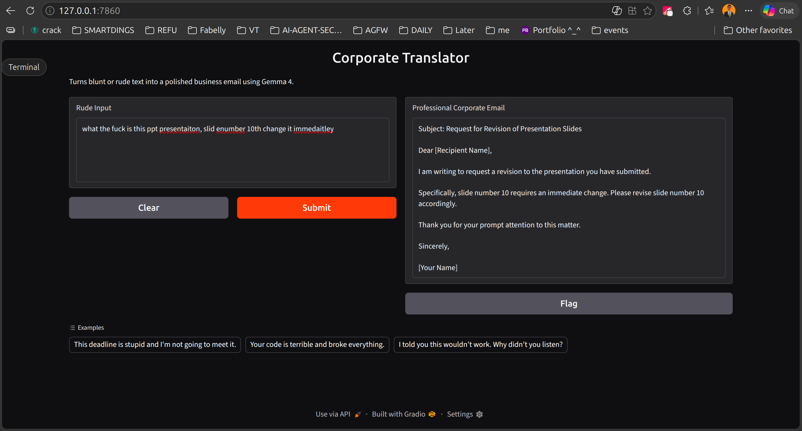

# Corporate Translator

Turns blunt, rude, or emotional text into polished business emails — running fully locally using a quantized Gemma 4 model.

## Screenshot



## How It Works

1. Paste any blunt or rude text into the input box.
2. Click **Submit**.
3. The local Gemma 4 model rewrites it as a professional, diplomatic business email.
4. Copy and send — no cloud, no data leaving your machine.

## Tech Stack

| Layer | Technology |
|---|---|
| LLM Runtime | [llama-cpp-python](https://github.com/abetlen/llama-cpp-python) |
| Model | Gemma 4 E2B Instruct — Q4_K_M GGUF (via LM Studio) |
| UI | [Gradio](https://www.gradio.app/) |
| Language | Python 3.12 |

## Setup

```bash
# Create a virtual environment
python3 -m venv venv
source venv/bin/activate

# Install dependencies
pip install llama-cpp-python gradio
```

Download the model from LM Studio (`lmstudio-community/gemma-4-E2B-it-GGUF`) and update `MODEL_PATH` in `app.py` if needed.

## Run

```bash
venv/bin/python app.py
```

Then open [http://localhost:7860](http://localhost:7860) in your browser.
