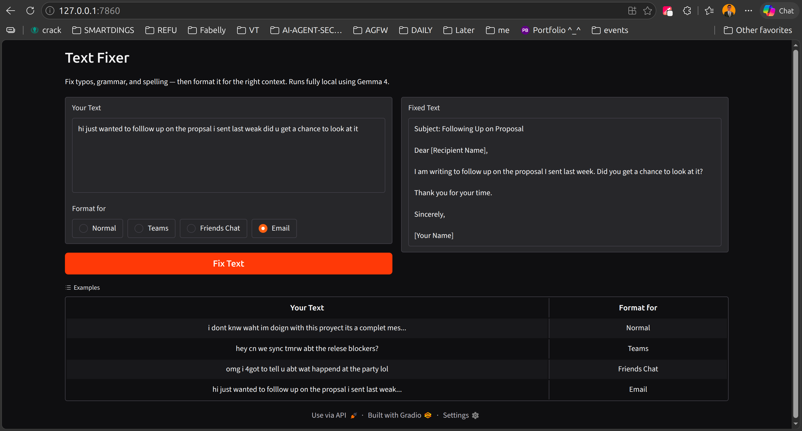
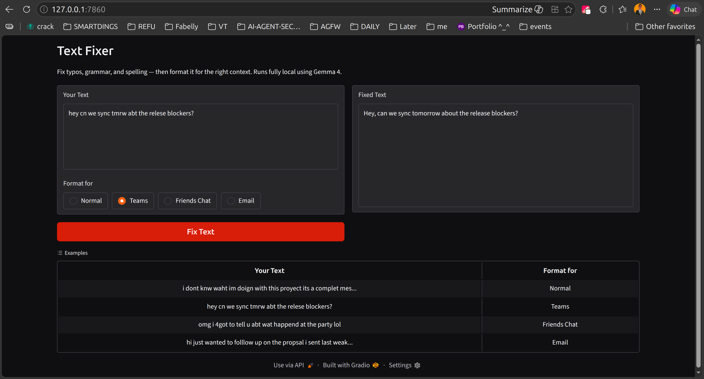

# Text Fixer

Instantly fixes typos, spelling mistakes, grammar errors, and punctuation — running fully locally using a quantized Gemma 4 model. No cloud, no data leaves your machine.

## Screenshots





## How It Works

1. Paste any text with typos, grammar issues, or spelling mistakes.
2. Click **Submit**.
3. The local Gemma 4 model corrects all mistakes while preserving your original meaning and tone.
4. Copy and use the fixed text.

## Tech Stack

| Layer | Technology |
|---|---|
| LLM Runtime | [llama-cpp-python](https://github.com/abetlen/llama-cpp-python) |
| Model | Gemma 4 E2B Instruct — Q4_K_M GGUF (via LM Studio) |
| UI | [Gradio](https://www.gradio.app/) |
| Language | Python 3.12 |

## Setup

```bash
# Create a virtual environment
python3 -m venv venv
source venv/bin/activate

# Install dependencies
pip install llama-cpp-python gradio
```

Download the model from LM Studio (`lmstudio-community/gemma-4-E2B-it-GGUF`) and update `MODEL_PATH` in `app.py` if needed.

## Run

```bash
venv/bin/python app.py
```

Then open [http://localhost:7860](http://localhost:7860) in your browser.
